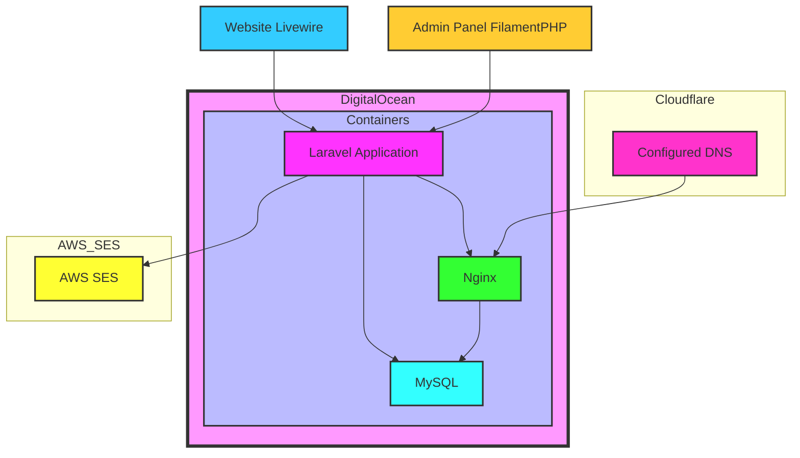

# Architecture

## Introduction

This document provides an overview of the architecture for our project. This architecture is designed to be scalable, maintainable, and secure, leveraging modern development practices and tools.

## Components

### Laravel Framework

Laravel serves as the core framework, providing a robust MVC structure, routing, Eloquent ORM, and a variety of utilities and services that streamline web development.

### Docker

Docker is used to containerise the application, ensuring consistency across development, staging, and production environments. It allows for easier dependency management and isolation.

### Livewire

Livewire is a full-stack framework for Laravel that makes building dynamic interfaces simple, without leaving the comfort of Laravel. It handles server-side rendering and provides reactivity in the frontend.

### FilamentPHP

FilamentPHP is used for creating complex administrative interfaces. It provides tools for building admin panels with ease, leveraging Laravel’s capabilities and simplifying backend management.

### Pest

Pest is a testing framework for PHP that provides a streamlined, user-friendly syntax. It is used for unit and integration testing to ensure code quality and reliability.

### DaisyUI + TailwindCSS

Component library for TailwindCSS. While Tailwind CSS provides utility classes for each CSS rule, daisyUI provides additional component class names to Tailwind CSS to make it faster and easier to build web pages. The project uses these two libraries together to build fancy and simple UI components.

### AWS Services

We utilise some AWS services such as:

- **AWS Simple Email Service:** we choose this service to implement a simple email delivering and without costs associated with.

### CloudFlare

We use CloudFlare to register and configure the domain and DNS. This choose were done because CloudFlare has the best performance, cost benefit and provides a free SSL certificate.

### DigitalOcean

The DigitalOcean was choose thinking about the Droplets feature. This service provides a simple machine to configure, maintain and deploy Laravel applications without having to configure a lot of separate services at once. Also, the cost of this service is very low.

## Architecture diagram

## Conclusion

This architecture ensures that our project is scalable, maintainable, and secure, leveraging modern technologies and best practices. Each component plays a critical role in the overall system, working together to provide a seamless user experience. If you have any questions or need further clarification, please contact the development team at [eng.gabrielscardoso@gmail.com](mailto:eng.gabrielscardoso@gmail.com).
